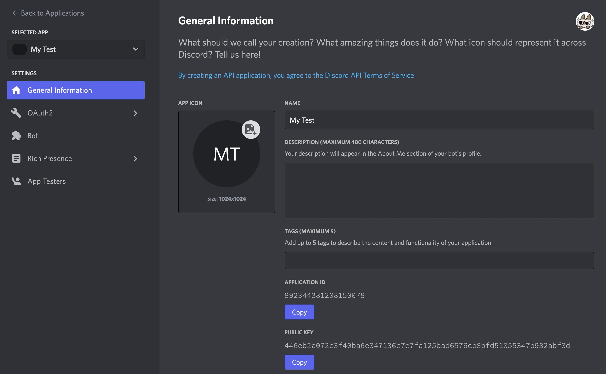
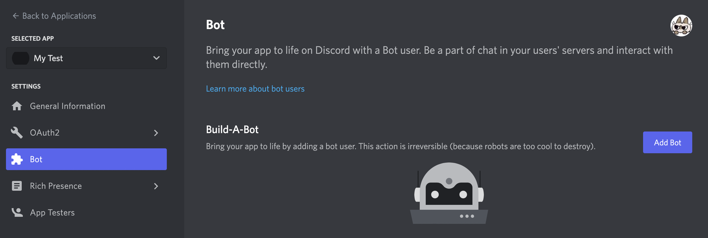
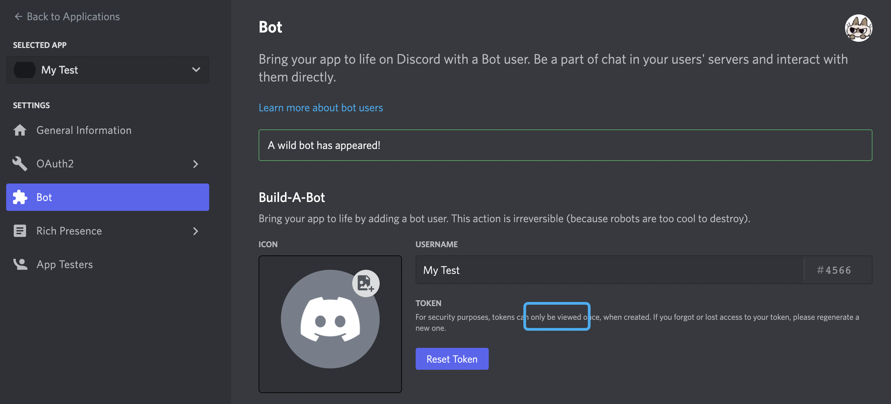
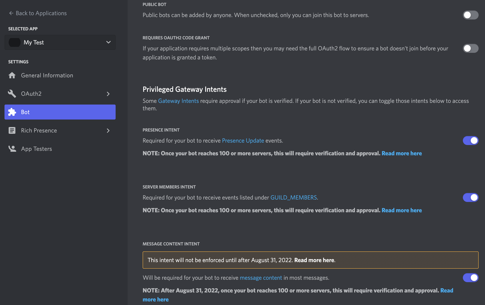
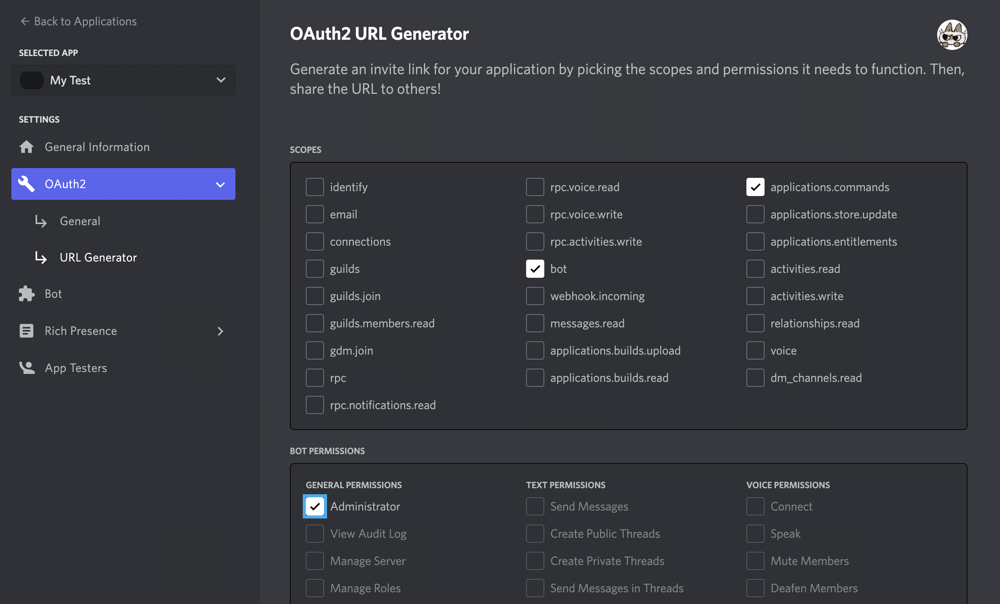

# Soil Test Bot

## This repo has been archived, please check [the latest one](https://github.com/Soil-labs/Eden_Discord_Bot).

This repo is for Soil Project. Click [here](https://share.descript.com/view/ek8jw2BigYa) to know more about this project and check our [Dework page](https://app.dework.xyz/developer-dao/soil) to know how to make a contribution and contact us.

## How to run it

This bot is run in Discord, so first, we need to obtain a Discord Bot Secret Key. Remember to **KEEP IT SAFE!** Anyone with this key can control your bot and Discord server.

### Create a Discord Application and a Bot

Enter this [webpage](https://discord.com/developers/applications) and click `New Application`.



Click `Bot` in the side bar and `Add Bot`.



Click `Reset Token` to get your Bot Secrete Key. Remember to **KEEP IT SAFE!**



Scroll down to disable `PUBLIC BOT`, enable the following three `INTENT`.



Finally, let's define the bot permission and invite the bot to your server! (Currently, we have not decided which permissions are needed in this project. Just for convenience, here I choose to grant Admin to our Bot). Scroll down, and copy the link to your explorer, choose your test Discord Server and you will see your cute bot come in to its sweet home!



### Configure Repo

Clone this repo and run the command in its root directory.

```shell
cd soil-test-bot
npm i
```

Next, edit the configuration file, `.env.template`. Fill your secret token in `TOKEN` and change `GUILDID` filed to your own Discord Server ID (Click [here](https://techswift.org/2020/04/22/how-to-find-your-user-id-on-discord/#:~:text=In%20any%20Discord%20server%2C%20click,to%20see%20your%20User%20ID.) to get how to find Discord Server ID). Then rename it with `.env`. Otherwise, you will get an error. Now everything is done, run it!

```shell
npm run index.js
```

Expected outputs:

```shell
[2022 07 01 05:37:44] INFO: Bot is online
[2022 07 01 05:37:47] INFO: Commands are set locally
```

